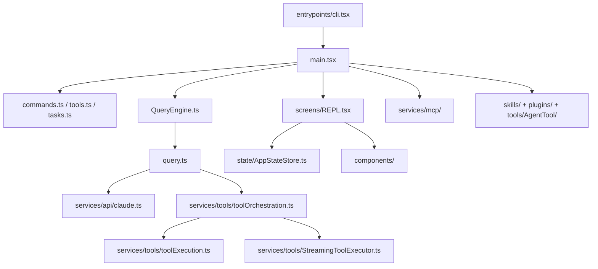

# Arquitetura Geral do Codigo

## Visao sintetica

O runtime principal pode ser entendido como uma pilha de sete camadas:

1. entrada de processo;
2. bootstrap e configuracao;
3. registradores de comandos, ferramentas e tarefas;
4. engine de conversa e loop de query;
5. servicos de API, MCP, compactacao e integracoes;
6. estado global, UI REPL e componentes;
7. extensibilidade por agentes, plugins e skills.

## Mapa arquitetural

## Camada 1: entrada de processo

### `entrypoints/cli.tsx`

Esse arquivo e a porta de entrada leve do binario. Ele existe para:

- tratar caminhos rapidos como `--version` sem carregar o runtime inteiro;
- aplicar ajustes de ambiente antes da carga pesada;
- desviar para modos especializados como bridge, daemon, bg sessions e runners;
- so depois disso importar o restante do sistema.

Esse desenho deixa claro que o projeto valoriza tempo de inicializacao e dead code elimination baseada em `feature('...')`.

## Camada 2: bootstrap pesado

### `main.tsx`

`main.tsx` e o verdadeiro agregador do runtime. Ele:

- dispara side effects de startup cedo;
- inicializa leitura de configuracao gerenciada e keychain;
- carrega contexto de usuario e sistema;
- integra telemetria, GrowthBook, politicas, MCP, plugins e skills;
- liga comandos, ferramentas, estado, sessao, UI e rotas auxiliares.

Em termos arquiteturais, `main.tsx` funciona como o compositing root do processo.

## Camada 3: registradores centrais

### `commands.ts`

Serve como registro mestre dos comandos slash e de utilitarios do produto. O arquivo agrega dezenas de modulos sob `commands/` e aplica gates por feature flag, tipo de usuario e integracoes opcionais.

### `tools.ts`

Define a lista exaustiva de ferramentas disponiveis no ambiente. O arquivo:

- monta o pool base de ferramentas;
- aplica gates por flag e ambiente;
- centraliza o que pode ou nao entrar no loop de tool use.

### `tasks.ts`

Repete a mesma ideia para tarefas de background ou infraestrutura:

- agent tasks locais;
- shell tasks locais;
- agent tasks remotas;
- dream tasks;
- tasks opcionais por feature.

## Camada 4: ciclo de conversa

### `QueryEngine.ts`

`QueryEngine` e o objeto de mais alto nivel para uma conversa persistente. Ele encapsula:

- mensagens mutaveis;
- uso acumulado;
- cache de leitura de arquivos;
- status de permissoes negadas;
- configuracao do turno;
- integracao com a funcao `query`.

### `query.ts`

`query.ts` implementa o loop agente-ferramenta propriamente dito. Ele:

- normaliza mensagens e contexto;
- chama a API do modelo;
- detecta `tool_use`;
- executa ferramentas;
- reinjeta `tool_result`;
- gerencia compactacao, limite de tokens, retries e hooks;
- encerra o turno com um estado terminal.

## Camada 5: servicos

Os servicos especializados vivem em `services/`. Entre os grupos mais importantes:

- `api/`: integracao com a API do modelo, streaming, retry, logging e custos;
- `mcp/`: conexao, configuracao e exposicao de ferramentas/recursos MCP;
- `tools/`: orquestracao e execucao de tool calls;
- `compact/`: estrategias de reducao e compactacao de contexto;
- `analytics/`: telemetria, tracing e gates dinamicos;
- `lsp/`: suporte a integracoes de linguagem.

## Camada 6: UI, estado e contexto

### `screens/REPL.tsx`

E a composicao principal da interface interativa. O arquivo e grande porque concentra:

- leitura de input;
- renderizacao de transcript;
- fila de comandos;
- selecao de mensagens;
- prompts de permissao;
- integracao com bridge, IDE, MCP, agentes e tarefas;
- persistencia e restauracao de sessao.

### `state/AppStateStore.ts`

Define o shape do estado global. O tipo `AppState` mostra que a aplicacao mistura:

- configuracao e modelo atual;
- contexto de permissoes;
- ponte remota e status de sessao;
- estado de plugins, MCP e agentes;
- tarefas, notificacoes e hooks;
- historico de arquivos, atribuicao e todos.

## Camada 7: extensibilidade

O runtime e explicitamente extensivel em quatro eixos:

1. `tools/`
2. `plugins/`
3. `skills/`
4. `tools/AgentTool/` + configuracoes de agentes

Essa extensibilidade e reforcada pela infraestrutura de `services/mcp/`, que expande tanto ferramentas quanto recursos e comandos.

## Arquivos-raiz que merecem leitura imediata

- `../../codigo_principal/claude_code_src/entrypoints/cli.tsx`
- `../../codigo_principal/claude_code_src/main.tsx`
- `../../codigo_principal/claude_code_src/QueryEngine.ts`
- `../../codigo_principal/claude_code_src/query.ts`
- `../../codigo_principal/claude_code_src/tools.ts`
- `../../codigo_principal/claude_code_src/tasks.ts`
- `../../codigo_principal/claude_code_src/Tool.ts`
- `../../codigo_principal/claude_code_src/state/AppStateStore.ts`
